# <h1 style="color:red;text-align: center">BÁO CÁO THỰC TẬP PHASE 1</h1>

## <h2 style="color:red;text-align: center">DỰ ÁN: THREATSCAN</h2>

## Thực tập sinh: Lê Thanh Linh & Hoàng Phúc Nhật Long - Sinh viên Khoa Kỹ thuật và Công nghệ - Đại học Huế

### Đơn vị: Công ty cổ phần Gcalls  
### Người hướng dẫn (Mentor): Phạm Tấn Phúc

  

## LỜI CẢM ƠN
Đầu tiên, nhóm em xin gửi lời cám ơn đến công ty Gcalls - nơi đã tạo điều kiện và cơ hội cho nhóm em có môi trường thực tập và học hỏi kiến thức.  
Xin gửi lời cảm ơn đến anh Phạm Tấn Phúc - mentor dự án Threatscan. Xin biết ơn anh đã dành thời gian để training và chia sẻ các kiến thức, kinh nghiệm, bài học bổ ích trong môi trường học tập và làm việc. Mặc dù nhóm em có hơi lơ là, chậm trễ trong việc hoàn thành các công việc nhưng anh vẫn ân cần hết mức hỗ trợ nhóm em hoàn hành thực tập phase 1.  
Và nhóm em cũng xin gửi lời cám ơn đến thầy, cô Khoa Kỹ thuật và Công nghệ - Đại học Huế đã có những sự hợp tác, thúc đẩy giáo dục, tạo điều kiện và cơ hội cho nhóm em học tập và trải nghiệm.  
Nhóm em xin chúc công ty ngày càng phát triển, đạt được nhiều thành công và giúp được nhiều bạn có cơ hội thực tập cũng như trải nghiệm môi trường làm việc thực tế.  
Xin chúc anh Phúc và các anh chị mentor, HR có nhiều sức khỏe, đạt được nhiều thành công trong công việc cũng như cuộc sống.  
Nhóm em xin chân thành cảm ơn!  

## CẤU TRÚC BÁO CÁO
LỜI CẢM ƠN  
CẤU TRÚC BÁO CÁO  
NỘI DUNG  
1. Demo JsSIP và SSH User  
1.1. JsSIP  
1.1.1. Giới thiệu JsSIP  
1.1.2. Tạo một cuộc gọi đơn giản với JsSIP  
1.1.3. Đánh giá  
1.2. SSH  
1.2.1. Tạo SSH User  
1.2.2. Tạo SSH keygen (Publics/Private)  
1.2.3. Đánh giá
2. Threatscan  
2.1 Scan IP Privates và IP Publics  
2.2 Scan Subdomains và Domains

## NỘI DUNG
### 1. Demo JsSIP và SSH User
#### 1.1. JsSIP
##### 1.1.1. Giới thiệu JsSIP
JsSIP là một thư viện JavaScript đơn giản và mạnh mẽ, được thiết kế để cung cấp các tính năng truyền thông thời gian thực (Real-Time Communications - RTC) cho các ứng dụng web. Với JsSIP, bạn có thể xây dựng các ứng dụng như:

- Điện thoại VoIP: Thực hiện và nhận cuộc gọi thoại qua mạng Internet.  
- Video call: Thực hiện cuộc gọi video trực tiếp trên trình duyệt.  
- Instant messaging: Gửi và nhận tin nhắn tức thời.  
- Presence: Kiểm tra trạng thái trực tuyến của người dùng khác.

Tài liệu tham khảo chính thức tại:  https://jssip.net/

##### 1.1.2. Tạo một cuộc gọi đơn giản với JsSIP
Input: Tài khoản SIP (uri), mật khẩu tài khoản SIP, WebSocket

Tài khoản SIP  
Đầu tiên, em thực hiện tạo một người dùng ở trang Gcalls (https://app.gcalls.co/g/admin/sipaccounts)  
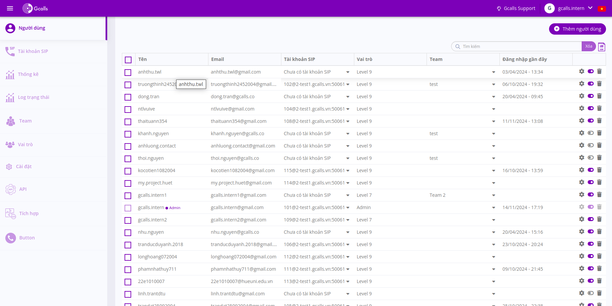

Sau đó thực hiện điền thông tin và nhấn Thêm  
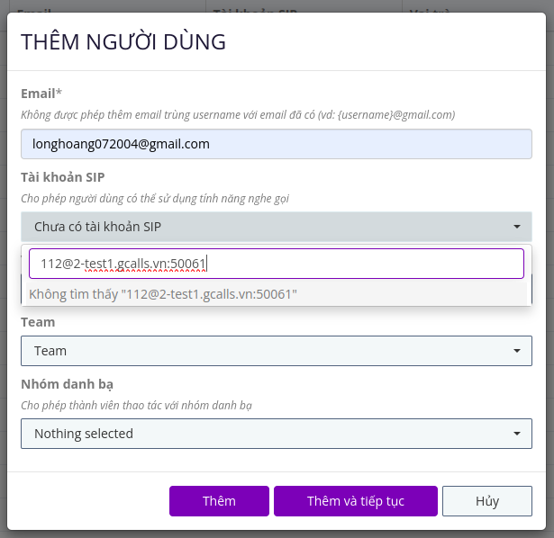  

Tiếp đó, thực hiện tạo một key API bằng cách chọn Thêm key ở góc phải  
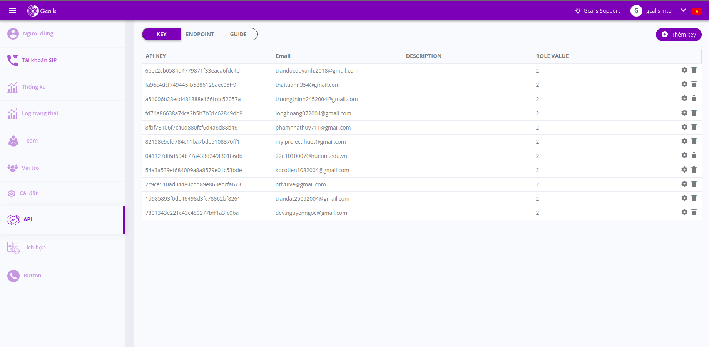  
Tiến hành điền thông tin sau đó chọn Ok  
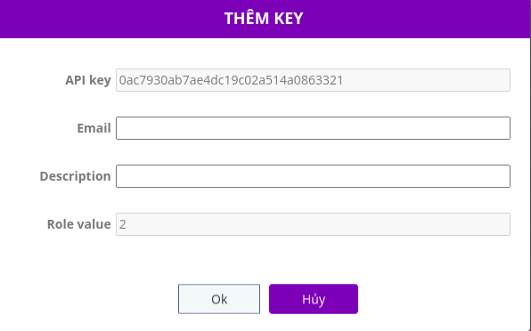  
Key API đã được thêm   
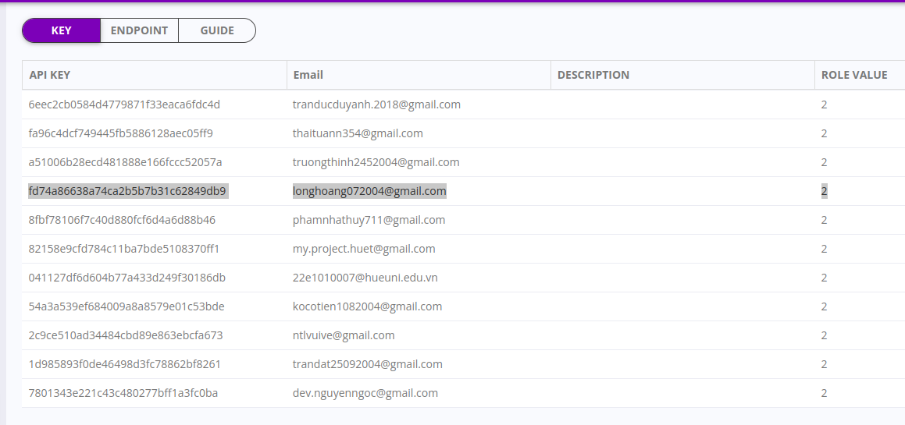

Để lấy được các thông tin đầu vào cho demo JsSIP như tài khoản (uri) và mật khẩu SIP, WebSocket. Ta tiến hành quét API đã tạo trước đó để lấy thông tin.  
Thực hiện viết một đoạn mã để quét API  
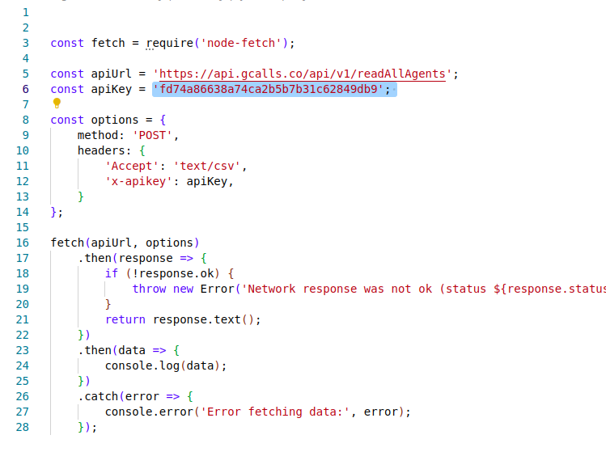  
Kết quả sau khi quét:  
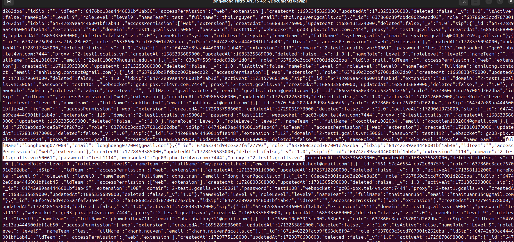  
Ta có thể nhận được một số thông tin cần thiết như:  
uri: 'sip:114@2-test1.gcalls.vn:50061'  
password: 'test1114'  
webSocket: 'wss://gc03-pbx.tel4vn.com:7444/'

Trước khi thực hiện demo thì nhóm em có kiểm tra tài khoản SIP có thể thực hiện được cuộc gọi đó hay không bằng phần thử mà JsSIP cung cấp: https://tryit.jssip.net/  

Để thực hiện demo JsSIP, em có tham khảo mã nguồn sau: https://github.com/zzzming/webrtc-sip  
Kết quả demo JsSIP (hình ảnh):   
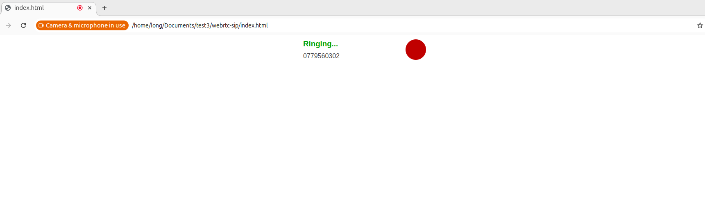  
Kết quả Demo JsSIP (video):  
https://drive.google.com/file/d/13nTNm1n5pQDmDGpLxF86SIUrCylQsc1H/view?usp=sharing  

##### 1.1.3. Đánh giá  
Thực hành một dự án mô hình với JsSIP là một bước đệm để nắm vững các kiến thức về truyền thông thời gian thực (RTC) và ứng dụng chúng vào thực tế.

***Hiểu Sâu Hơn Về JsSIP và WebRTC***
- Cơ chế hoạt động: Cách JsSIP làm việc, cách tương tác với các giao thức SIP và WebRTC, từ việc thiết lập cuộc gọi đến việc truyền tải dữ liệu âm thanh/video.
- API và cấu hình: Làm quen với các API của JsSIP, cách cấu hình các thông số như server SIP,...
- Xử lý sự kiện: Cách xử lý các sự kiện khác nhau trong quá trình giao tiếp, như nhận cuộc gọi, kết thúc cuộc gọi, lỗi mạng, v.v.  

***Kiến Thức Về Truyền Thông Thời Gian Thực***  
- SIP: giao thức SIP, các thông điệp SIP và vai trò của chúng trong quá trình thiết lập và duy trì cuộc gọi.  
- WebRTC.

#### 1.2. SSH
##### 1.2.1. Tạo SSH User
1. Tạo SSH User:  
Vào server bằng tài khoản root: ssh root@103.56.162.72 -p 24700  
Pass: Tel4vn@2024$SV#  
Sau đó thực hiện tạo ssh user   
ssh adduser hpnlong (username: hpnlong)  
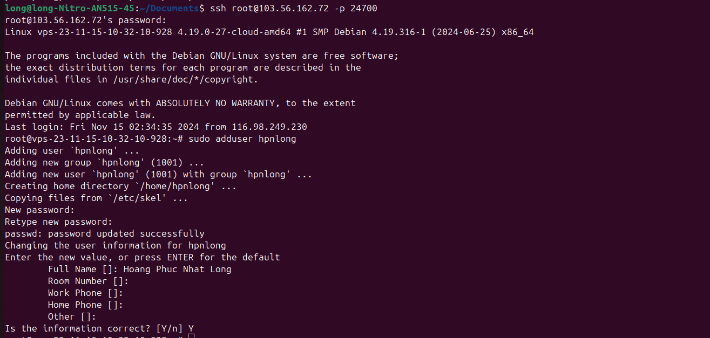
2. SSH Keygen và xác thực kết nối bằng Publics Key/Privates Key  
Cơ chế xác thực  
Cơ chế xác thực bằng SSH Keygen là một phương thức xác thực trong giao thức SSH. Nó hoạt động bằng cách sử dụng cặp Public Key và Private Key để xác nhận người dùng khi truy cập vào máy chủ SSH.  
Public Key là khóa chung, là một file văn bản – nó được lưu trữ ở phía máy chủ SSH và được sử dụng để kiểm tra sự phù hợp giữa Private Key (file lưu trên máy khách) và Public Key này khi khách hàng gửi Private Key lên để xác thực kết nối   
Private Key là khóa riêng, là một file văn bản, chứa mã riêng để xác thực. Khi kết nối SSH, máy khách phải chỉ định rõ file này thay vì nhập mật khẩu để đảm bảo tính bảo mật. Vì vậy, nên lưu trữ file Private Key cẩn thận vì bất kỳ ai có file này đều có thể truy cập vào máy chủ của bạn.  
##### 1.2.2. Tạo SSH keygen (Publics/Private)  
Mở Terminal  
Sử dụng lệnh sau: ssh-keygen -t rsa   để tạo keygen (Publics_keys/Privates_keys) trên máy tính  
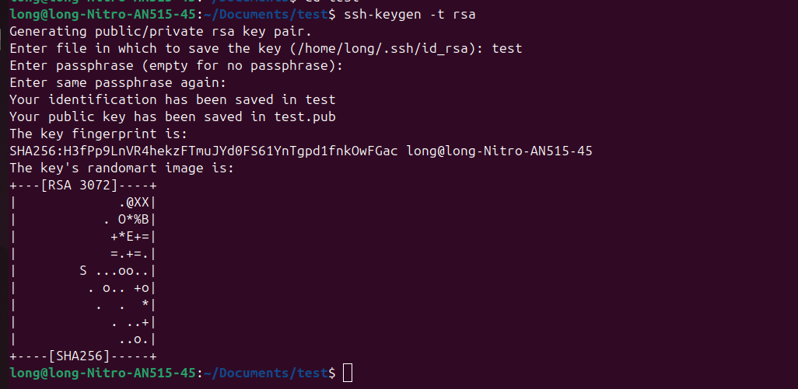

**Đối với trên server:** Vào server bằng user đã tạo trước đó là hpnlong   tạo một thư mục .ssh, sau đó tạo file authorized_keys để chứa publics key.  
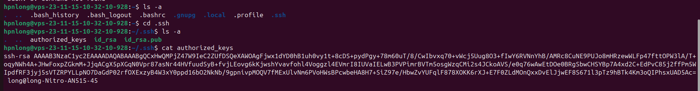

**Đối với trên máy tính:** thư mục .ssh sẽ tồn tại file Long  chứa privates key.  
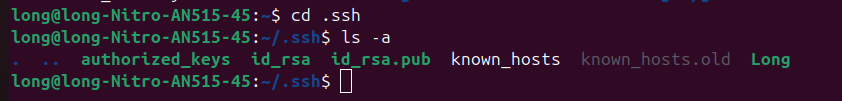  
Tiến hành cấp quyền cho thư mục .ssh và Long trên máy tính bằng lệnh  chmod 700 ...    
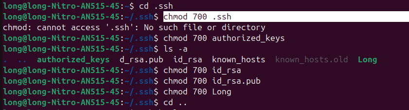  
Tiến hành cấp quyền cho cả file .ssh chứa file authorized_keys chứa public_key trên server bằng lệnh  chmod 700 ...   
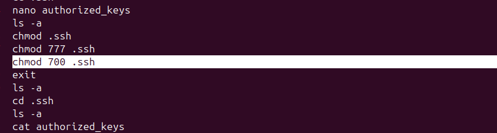  
Thay đổi chủ sở hữu từ root sang user hpnlong bằng lệnh: chown -R hpnlong:hpnlong /home/hpnlong/.ssh  /home/hpnlong/.bashrc  
Cuối cùng, exit và tạo terminal mới  
Vào server bằng ssh user đã xác thực keygen: ssh -i .ssh/Long hpnlong@103.56.162.72 --p 24700  
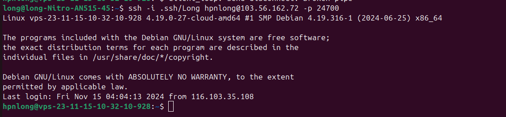  
##### 1.2.3. Đánh giá  
**Hiểu biết về SSH và ứng dụng thực tế**  
SSH (Secure Shell) là một giao thức quan trọng để quản lý và bảo mật kết nối từ xa với server. Việc học và thực hành với SSH không chỉ giúp nắm bắt được cách truy cập và quản lý server mà còn tăng cường khả năng bảo mật thông tin khi làm việc với các hệ thống từ xa.

**Tổng kết kiến thức**  
- Tạo SSH User: Quy trình tạo tài khoản người dùng SSH mới trên hệ điều hành Ubuntu. Từ việc phân quyền cho user đến việc quản lý bảo mật cho từng tài khoản và tầm quan trọng của việc cấu hình chính xác trong môi trường server.

- Xác thực bằng Keygen: Việc sử dụng cặp khóa (public key và private key) thay vì mật khẩu giúp cải thiện đáng kể bảo mật kết nối. Cách tạo khóa SSH bằng công cụ ssh-keygen, hiểu cơ chế xác thực không dùng mật khẩu và biết cách triển khai cặp khóa vào server.

- Kết nối với server: Thực hành việc kết nối với server bằng giao thức SSH, không chỉ qua cổng mặc định mà còn cấu hình các cổng khác để tăng cường bảo mật. Việc này giúp nhóm em thành thạo trong việc truy cập server từ xa và quản lý các tác vụ trên môi trường CLI (Command Line Interface).

### 2. Threatscan
#### 2.1. Scan IP Privates và IP Publics
**Chuẩn bị dữ liệu**  
File IP Privates cần scan: [IP Privates](./input/threatscanPrivates.csv)   
  
File IP Publics cần scan:[IP Publics](./input/threatscanPublics.csv)  
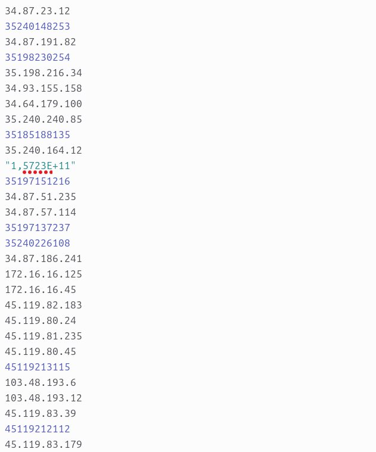  

**Viết file shell script**  
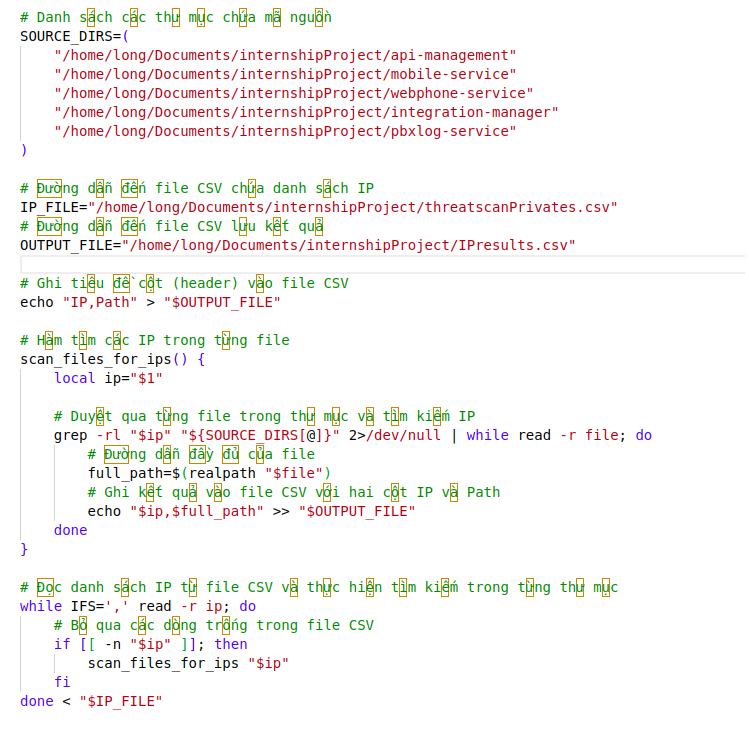  
***Input và Output***
- Biến SOURCE_DIRS là một mảng chứa danh sách các thư mục mà bạn muốn tìm kiếm. Mỗi thư mục này chứa mã nguồn của các dự án khác nhau.  
- Các thư mục này sẽ được dùng làm các thư mục gốc để grep quét qua tất cả các file con bên trong.  
- IP_FILE là đường dẫn đến file CSV chứa danh sách các địa chỉ IP cần tìm kiếm trong mã nguồn.  
- File này phải có định dạng CSV, mỗi dòng chứa một IP cần quét.  
- OUTPUT_FILE là đường dẫn đến file CSV nơi kết quả tìm kiếm sẽ được lưu lại.  
- File này sẽ chứa các cột IP và Path (đường dẫn đầy đủ của các file chứa IP).  

***Tìm các IP trong từng file***
- Hàm scan_files_for_ips nhận một IP làm tham số.  
- Dòng lệnh grep -rl "$ip" "${SOURCE_DIRS[@]}" 2>/dev/null  tìm kiếm IP trong tất cả các file trong các thư mục được chỉ định trong SOURCE_DIRS.  
- grep -r: Tìm kiếm đệ quy (tìm trong các thư mục con).  
- -l: Chỉ in ra tên các file chứa kết quả.  
- 2>/dev/null: Ẩn các thông báo lỗi (ví dụ: không có quyền đọc file, hoặc thư mục trống).  
- Sau khi tìm được các file chứa IP, hàm realpath sẽ lấy đường dẫn đầy đủ của file đó.  
- Kết quả tìm kiếm sẽ được ghi vào file CSV, mỗi dòng chứa IP và đường dẫn đầy đủ của file.  

***Đọc danh sách IP từ file CSV và thực hiện tìm kiếm***  
- Đọc từng dòng trong file IP_FILE, mỗi dòng chứa một địa chỉ IP cần tìm.  
- IFS=',' thiết lập dấu phân cách trường trong file CSV là dấu phẩy (,).  
- Mỗi khi đọc xong một dòng chứa IP, hàm scan_files_for_ips sẽ được gọi để tìm IP đó trong các thư mục mã nguồn.  
- if [[ -n "$ip" ]]; then: Kiểm tra xem dòng đọc được có chứa dữ liệu hay không (tránh các dòng trống).  

**Kết quả**  
Scan file IP Privates:  
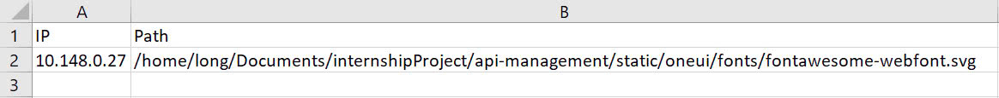  
Scan file IP Publics: Không có   
#### 2.2 Scan Subdomains và Domains  
**Chuẩn bị dữ liệu**  
File subdomains cần scan: [subdomains](./input/subdomains.csv)  
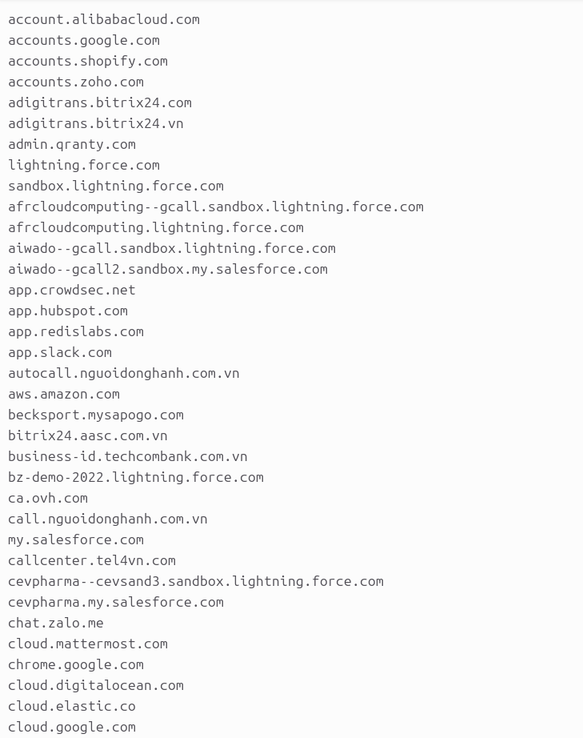  
File domains cần scan: [domains](./input/domains.csv)  
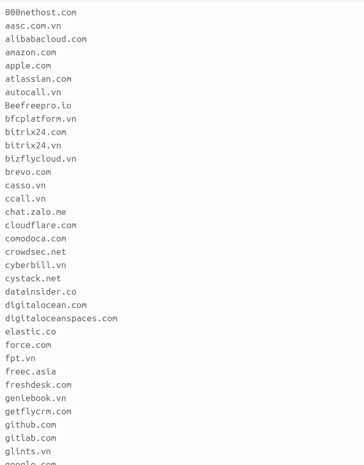

**Viết file shell script**  
Tương sự giống shell script scan IP Pubblics/Privates, chỉ khác output là các trường dữ liệu.  
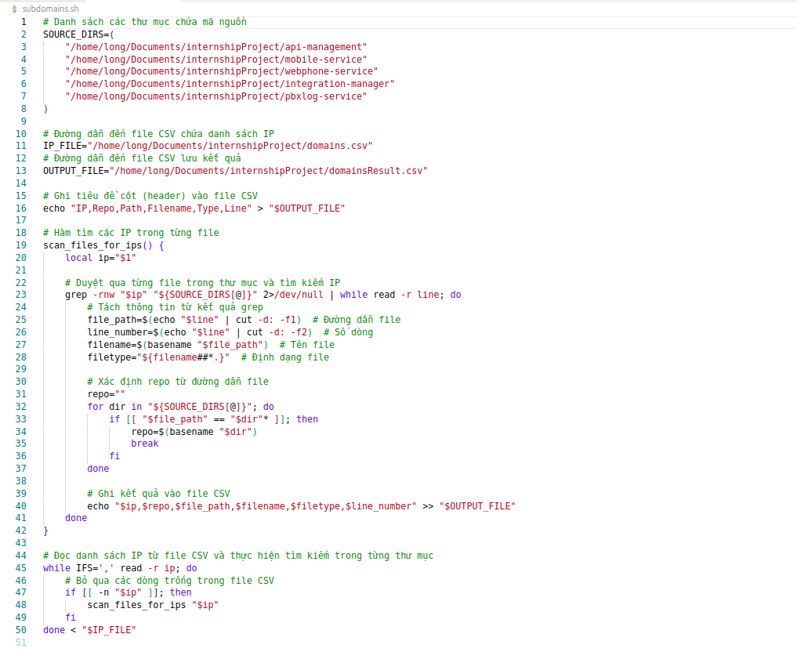

**Kết quả**  
Scan file subdomains.csv  
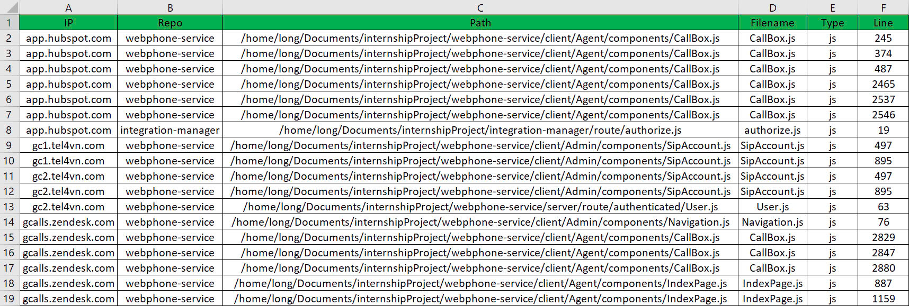  
Scan file domains.csv 
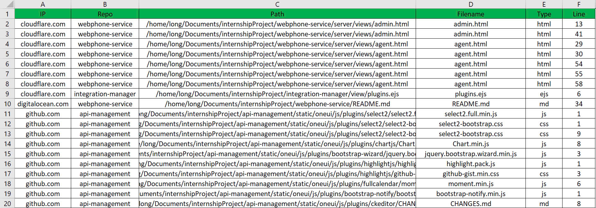  